[Dynamic Routes Segments Params]: https://nextjs.org/docs/app/api-reference/file-conventions/dynamic-routes#catch-all-segments
[SearchParams]: https://nextjs.org/docs/app/getting-started/layouts-and-pages#rendering-with-search-params

# 📦 `@onlywatch/nextjs-route-segments-params`

[](https://wise.com/pay/me/luzhic1)
[](https://www.npmjs.com/package/@onlywatch/nextjs-route-segments-params)
[](https://codecov.io/gh/aqzhyi/onlywatch.tw/tree/dev/@packages/nextjs-route-segments-params)
[](https://www.npmjs.com/package/@onlywatch/nextjs-route-segments-params?activeTab=dependencies)
[](https://bundlephobia.com/package/@onlywatch/nextjs-route-segments-params)


> [!NOTE]
>
> 🔋 improve developers' experience in handling `[[...segmentsParams]]` route params for [Dynamic Routes Segments Params] in Next.js

## ✨ Motivation

since...

- [SearchParams] is does not support next.js (Partial) Pre-Rendering
- [Dynamic Routes Segments Params] is support next.js (Partial) Pre-Rendering

i wanna to...

- take `/mall/query/rtx 5090` instead of `/mall?query=rtx 5090`

and...

- manage the Segments Params and URL changes when updating the state in the Client Component

---

## 🖼️ Sequence Diagram

- `useSegments` is used in Client Component
- `parseSegments` is used in Server Component

```mermaid
sequenceDiagram
    participant User as 🙎‍♂️ User
    participant NextJS as Next.js
    participant RSC as Server Component
    participant RCC as Client Component
    participant Input as Input Element
    participant Submit as Submit Button

    User->>NextJS: visit URL '/mall/query/iphone'
    note over User,NextJS: route: /mall/[[...segmentsParams]]/page.tsx

    NextJS->>RSC: props.params.segmentsParams = ['query', 'iphone']
    RSC->>RSC: parseSegments(['query'], ['query', 'iphone'])
    note over RSC: returns { query: 'iphone' }

    RSC->>RCC: render with initial params
    RCC->>RCC: useSegments(['query'])
    note over RCC: const { params, setParams, pushUrl, replaceUrl }

    RCC->>Input: render controlled input
    note over Input: value={params.query} // 'iphone'

    User->>Input: 🙎‍♂️ typing 'rtx 5090'
    Input->>RCC: onChange event
    RCC->>RCC: setParams((prev) => ({...prev, query: 'rtx 5090'}))
    note over RCC: internal state updated
    RCC->>Input: re-render with new value
    note over Input: value={params.query} // 'rtx 5090'

    User->>Submit: 🙎‍♂️ click submit button
    Submit->>RCC: onClick event
    RCC->>RCC: pushUrl()
    RCC->>NextJS: router.push('/mall/query/rtx 5090')
    NextJS->>User: URL changed & page re-rendered
    note over User,NextJS: new URL: /mall/query/rtx 5090
```



---

## ✨ Basic Example

### 🧩 NextPage, the Server Component

```tsx
import { parseSegments } from '@onlywatch/nextjs-route-segments-params/utils'

export async function generateStaticParams() {
  const routes: { params: string[] }[] = []

  // 💡 pre-rendered logic
  routes.push({ params: ['brand', 'nvidia', 'query', 'rtx 5090'] })

  return routes
}

export default async function NextPage(
  props: PageProps<'/[locale]/mall/[[...segmentsParams]]'>,
) {
  // 💡 segmentsParams returns `['brand', 'nvidia', 'query', 'rtx 5090']`
  const { segmentsParams = [] } = await props.params

  // 💡 params returns `{ brand: 'nvidia', query: 'rtx 5090' }`
  const params = parseSegments(['brand', 'query'], segmentsParams)

  return <div>...</div>
}
```

### 🧩 React, the Client Component

```tsx
'use client'

import { useSegments } from '@onlywatch/nextjs-route-segments-params/hooks'

export function ReactClientComponent() {
  const { params, setParams, pushUrl, replaceUrl } = useSegments([
    'brand',
    'query',
  ])

  return (
    <div>
      <pre>{JSON.stringify(params, null, 2)}</pre>

      <input
        placeholder='Search...'
        value={params.query}
        onChange={(event) => {
          setParams((prev) => ({ ...prev, query: event.target.value }))
        }}
      />

      <button
        onClick={() => {
          setParams((prev) => ({ ...prev, brand: 'nvidia' }))
        }}
      >
        Nvidia
      </button>

      <button
        onClick={() => {
          setParams((prev) => ({ ...prev, query: 'rtx 5090' }))
        }}
      >
        query
      </button>

      <button
        onClick={() => {
          pushUrl()
        }}
      >
        Push a new URL to History stack
      </button>

      <button
        onClick={() => {
          replaceUrl()
        }}
      >
        Replace URL in History stack
      </button>
    </div>
  )
}
```
