[Catch-All Segments Route Params]: https://nextjs.org/docs/app/api-reference/file-conventions/dynamic-routes#catch-all-segments
[SearchParams]: https://nextjs.org/docs/app/getting-started/layouts-and-pages#rendering-with-search-params

# @onlywatch/use-catch-all-next-params

[](https://wise.com/pay/me/luzhic1)
[](https://www.npmjs.com/package/@onlywatch/use-catch-all-next-params)
[](https://codecov.io/gh/aqzhyi/onlywatch.tw/tree/dev/@packages/use-catch-all-next-params)


## ✨ Notable

> [!NOTE]
>
> 🚀 Type-safe Next.js [Catch-All Segments Route Params] and URL management
>
> 🧭 focusing on enhancing the development experience for `[[...NextParams]]` route params

### ✨ Why

- 💥 [SearchParams] in Next.js does not support pre-rendering

- ✅ [Catch-All Segments Route Params] in Next.js support pre-rendering

- 🚀 you need the URL `'/mall/query/rtx 5090'` instead of `'/mall?query=rtx 5090'` and use a pre-rendering mechanism to improve the initial loading speed of the webpage

- 🛡️ for `NextPage` and `Client Components` handling the URL `'/mall/query/rtx 5090'`, with type safety

## 📦 Installation

```sh
pnpm add @onlywatch/use-catch-all-next-params
```

## ✨ Basic Usage

> [!IMPORTANT]
>
> assume route designed is `/[locale]/mall/[...nextParams]/page.tsx`
>
> assume URL currently is `/zh-tw/mall/brand/nvidia/query/rtx 5090`

### 🧩 NextPage, the Server Component

```tsx
import { useCatchAllNextParams } from '@onlywatch/use-catch-all-next-params'
import { parseCatchAllSegments } from '@onlywatch/use-catch-all-next-params/utils'

export async function generateMetadata(): Promise<Metadata> {
  // 💡 pre-rendered metadata

  return {
    title: 'site.name',
    description: 'site.document.description',
    keywords: 'site.document.keywords',
  }
}

export async function generateStaticParams() {
  const routes: { params: string[] }[] = []

  // 💡 pre-rendered logic
  routes.push({ params: ['brand', 'nvidia', 'query', 'rtx 5090'] })

  return routes
}

export default async function NextPage(
  props: PageProps<'/[locale]/mall/[[...nextParams]]'>,
) {
  const routeTemplate = '/mall/brand/{brand}/query/{query}'

  // 💡 nextParams returns `['brand', 'nvidia', 'query', 'rtx 5090']`
  const { nextParams = [] } = await props.params

  // 💡 params returns `{ brand: 'nvidia', query: 'rtx 5090' }`
  const params = parseCatchAllSegments(nextParams, routeTemplate)

  return <div>...</div>
}
```

### 🧩 React, the Client Component

```tsx
'use client'

export function ReactClientComponent() {
  const routeTemplate = '/mall/brand/{brand}/query/{query}'

  const { params, setParams, pushUrl, replaceUrl } =
    useCatchAllNextParams(routeTemplate)

  return (
    <div>
      <pre>{JSON.stringify(params, null, 2)}</pre>

      <input
        placeholder='Search...'
        value={params.search}
        onChange={(event) => {
          setParams((prev) => ({ ...prev, search: event.target.value }))
        }}
      />

      <button
        onClick={() => {
          setParams((prev) => ({ ...prev, brand: 'nvidia' }))
        }}
      >
        Nvidia
      </button>

      <button
        onClick={() => {
          setParams((prev) => ({ ...prev, search: 'rtx 5090' }))
        }}
      >
        Search
      </button>

      <button
        onClick={() => {
          pushUrl()
        }}
      >
        Push a new URL to History stack
      </button>

      <button
        onClick={() => {
          replaceUrl()
        }}
      >
        Replace URL in History stack
      </button>
    </div>
  )
}
```

## 🖼️ Sequence Diagram

```mermaid
sequenceDiagram
    user->>nextjs: 🙎‍♂️ visit URL '/mall/query/iphone' directly
    note over user,nextjs: route `/mall/[[...nextParams]]/page.tsx` designed

    nextjs-->>parseCatchAllSegments: NextParams returns ['query', 'iphone']
    parseCatchAllSegments-->>generateStaticParams: parseCatchAllSegments(['query', 'iphone'], '/mall/query/{query}')
    note over parseCatchAllSegments,generateStaticParams: returns `{ query: 'iphone' }`

    generateStaticParams-->>user: pre-rendered pages for user visit

    Client Component-->>useCatchAllNextParams: with route template: '/mall/query/{query}'
    note over Client Component,useCatchAllNextParams: {<br>params, setParams, pushUrl, replaceUrl<br>}<br> = useCatchAllNextParams('/mall/query/{query}')

    Client Component-->>Input: controlled `<input />`
    note over Client Component,Input: value={'iphone'} <br> onChange={function() { setParams(...) }

    user->>Input: 🙎‍♂️ user typing words with 'rtx 5090'
    Input-->>useCatchAllNextParams: setParams((prev) => ({ ...prev, query: 'rtx 5090'}))
    useCatchAllNextParams-->>Input: value={'rtx 5090'}
    user->>Submit: 🙎‍♂️ user clicks
    Submit-->>useCatchAllNextParams: pushUrl()
    useCatchAllNextParams-->>nextjs: router.push('/mall/query/rtx 5090')
    nextjs-->>user: URL changed to /mall/query/5090<br>page re-rendered
```



## 📚 Interface Design

```ts
function useCatchAllNextParams(baseUrl: string): {
  params: CurrentNextParamsObject
  setParams: (
    updater:
      | NextParamsObject
      | ((prev: PreviousNextParamsObject) => NextParamsObject),
  ) => void
  pushUrl: () => void
  replaceUrl: () => void
}
```

### 🛠 Examples

> [!TIP]
>
> 👀 See [useCatchAllNextParams](./src/hooks/useCatchAllNextParams.ts)

> [!NOTE]
>
> 🎯 Hook for managing URL parameters with type safety

```tsx
// 🚀 Basic Interfaces
const { params, setParams, pushUrl, replaceUrl } =
  useCatchAllNextParams('/search/{query}')
```

---

```tsx
// 🚀 More complex baseUrl
useCatchAllNextParams('/mall/brand/{brand}/search/{query}')
useCatchAllNextParams('/calendar/search/{query}/date/{date}/')
```

---

```tsx
// 🚀 Basic Usage
const { params, setParams, pushUrl } = useCatchAllNextParams('/search/{query}')

// set params to { query: 'rtx 5080' }
setParams({ query: 'rtx 5080' })

// navigates the URL to '/search/rtx 5080'
pushUrl()
```

---

```tsx
// assume baseUrl set to '/mall/brand/{brand}/search/{search}'
// assume current URL is '/mall/brand/amd/search/rtx 5090'

// 🚀 params is { brand: 'amd', search: 'rtx 5090' }
console.info(params)
```

---

```tsx
// assume baseUrl set to '/mall/brand/{brand}/search/{search}'
// assume current URL is '/mall/brand/amd/search/rtx 5090'

// 🚀 replace all params with new NextParams:

// now params is { brand: 'msi' }
setParams({ brand: 'msi' })

// now params is { brand: 'gigabyte' }
setParams({ brand: 'gigabyte' })

// now params is { search: '1080' }
setParams({ search: 'rtx 1080' })

// now params is { brand: 'nvidia', search: 'rtx 2080' }
setParams({ brand: 'nvidia', search: 'rtx 2080' })
```

---

```tsx
// assume baseUrl set to '/mall/brand/{brand}/search/{search}'
// assume current URL is '/mall/brand/amd/search/rtx 5090'

// �� merging with prev NextParams:

// now params is { brand: 'amd', search: 'rtx 2080' }
setParams((prev) => ({ ...prev, search: 'rtx 2080' }))

// now params is { brand: 'nvda', search: 'rtx 5090' }
setParams((prev) => ({ ...prev, brand: 'nvda' }))
```

---

```tsx
// assume baseUrl set to '/mall/brand/{brand}/search/{search}'
// assume current URL is '/mall/brand/amd/search/rtx 5090'

// 🚀 remove both parameters:
setParams((prev) => ({ ...prev, brand: undefined, search: undefined }))

// now the URL will be '/mall'
pushUrl()
```

```tsx
// assume baseUrl set to '/mall/brand/{brand}/search/{search}'
// assume current URL is '/mall/brand/amd/search/rtx 5090'

//
// 🚀 remove the specified parameter 'search':
setParams((prev) => ({ ...prev, search: null }))

// now the URL will be '/mall/brand/amd'
pushUrl()

//
// 🚀 remove the specified parameter 'brand':
setParams((prev) => ({ ...prev, brand: null }))

// now the URL will be '/mall/search/rtx 5090'
pushUrl()
```
