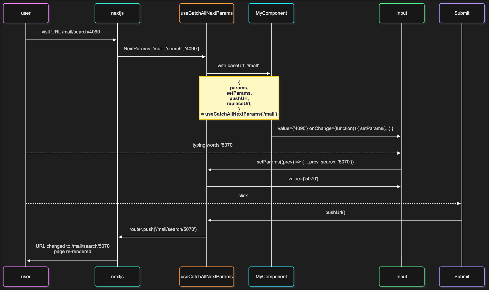

# @onlywatch/use-catch-all-next-params

> 🚀 Type-safe Next.js Catch-All Segments Route Params and URL management
>
> 🧭 focusing on enhancing the development experience for `[[...NextParams]]` route params

## 📦 Installation

```sh
pnpm add @onlywatch/use-catch-all-next-params
```

## ✨ Basic Usage

```tsx
// when route is `/app/mall/[...nextParams]/page.tsx`
// when URL is `/mall`

export default function ReactClientComponent() {
  const { params, setParams, pushUrl, replaceUrl } =
    useCatchAllNextParams<['brand', 'search']>('/mall')

  return (
    <div>
      <pre>{JSON.stringify(params, null, 2)}</pre>

      <input
        value={params.search}
        onChange={(event) => {
          setParams((prev) => ({ ...prev, search: event.target.value }))
        }}
        placeholder='Search...'
      />

      <button
        onClick={() => setParams((prev) => ({ ...prev, brand: 'nvidia' }))}
      >
        設定品牌
      </button>

      <button
        onClick={() => setParams((prev) => ({ ...prev, search: 'rtx 5090' }))}
      >
        更新搜尋
      </button>

      <button onClick={() => pushUrl()}>Push to History</button>

      <button onClick={() => replaceUrl()}>Replace Current URL</button>
    </div>
  )
}
```



## 📚 Interface

```ts
function useCatchAllNextParams<T extends readonly string[]>(
  baseUrl: string,
  options?: {
    maxParamValueLength?: number // defaults `1000`
  },
): {
  params: ParamsObject<T>
  setParams: (
    updater: ParamsObject<T> | ((prev: ParamsObject<T>) => ParamsObject<T>),
  ) => void
  pushUrl: () => void
  replaceUrl: () => void
}
```

## 🔍 Advanced Examples

> [!TIP]
>
> Separate parameter state management from navigation

```ts
// Update parameters without navigating
setParams({ brand: 'amd' })

// Then navigate when ready
pushUrl() // Adds to history stack
```

> [!TIP]
>
> Replace current URL without adding to history

```ts
setParams({ brand: 'nvidia' })
replaceUrl() // Updates current URL without adding to history
```

> [!TIP]
>
> Multiple rapid consecutive calls (queue protection)

```ts
filters.forEach((f) => setParams((p) => ({ ...p, ...f })))
// The hook executes safely in queue order to avoid race conditions
```

> [!TIP]
>
> Functional updates for complex state changes

```ts
setParams((prev) => ({
  ...prev,
  brand: 'intel',
  search: prev.search || 'default',
}))
```

> [!TIP]
>
> Dynamic composition and partial removal

```ts
setParams((p) => ({ brand: p.brand, search: undefined }))
// search will be removed (undefined / empty strings won't be written)
```
