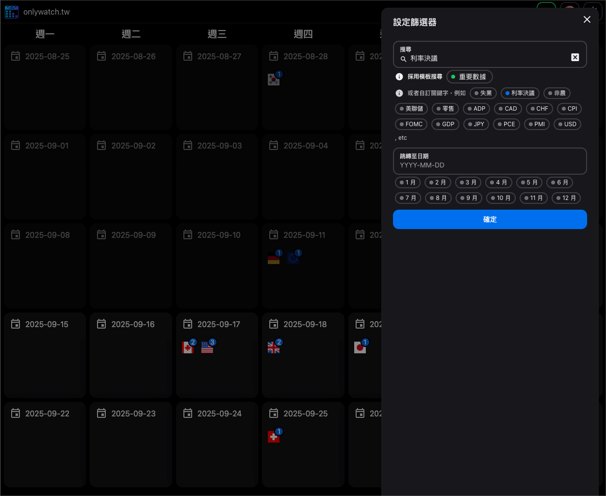
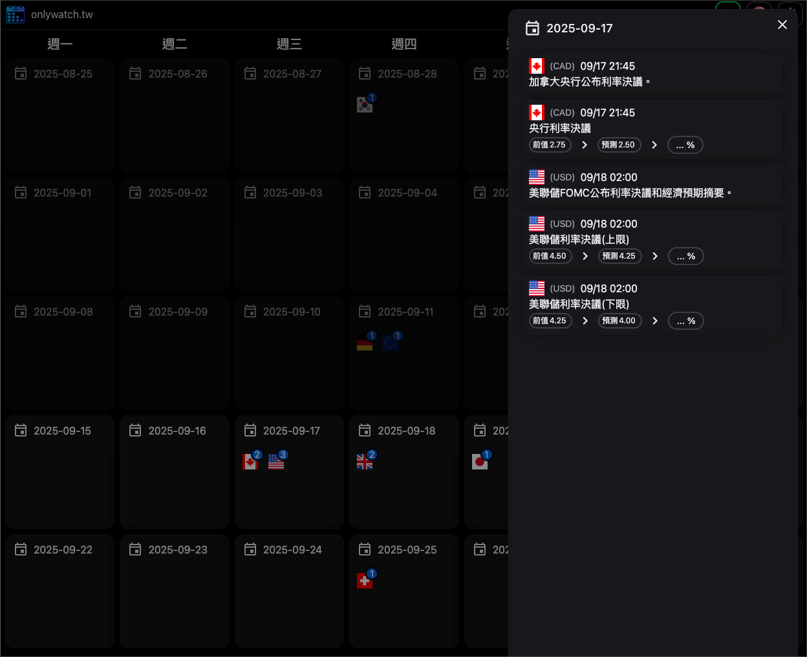
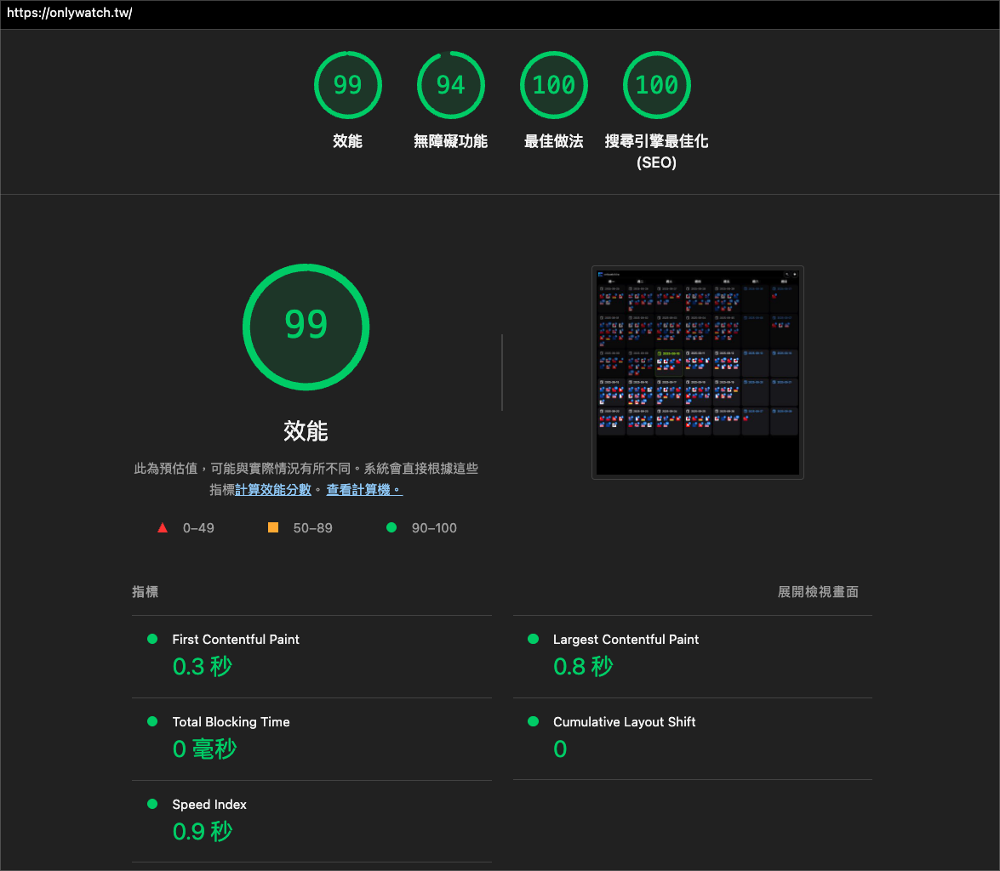

# 💬 About <a href="https://onlywatch.tw">onlywatch.tw</a>

<!-- shields.io supports icons from https://simpleicons.org -->

> [!TIP]
>
> this tool is mainly provided for long-term swing traders and fundamental investors in macroeconomics to plan their entry and exit trading strategies
>
> it could be very effective for monthly and quarterly swing traders

## 🔋 Notable

- 📅 a clearer browsing experience for events over the next several weeks

  > expected to enhance the efficiency of planning quarterly swing trading

- 🔍 quickly keywords search and shareable URLs

  > expected to quickly find and save the upcoming `events` that only you care about

## ⚡ try it now

[https://onlywatch.tw](https://onlywatch.tw)

[https://onlywatch.tw/query/{keyword:利率決議}](https://onlywatch.tw/query/%E5%88%A9%E7%8E%87%E6%B1%BA%E8%AD%B0)

[https://onlywatch.tw/query/{...keywords}](https://onlywatch.tw/query/非農%20cpi%20pce%20利率決議%20就業人數%20貿易帳%20失業金人數%20鮑威爾%20川普%20普丁%20零售銷售%20PMI%20央行)

---

---

## 🔋 Technical Concerns

### ⚡ performance

- 🟢 Lighthouse is **green**

  

- ⏩ Vercel Speed Insights is **green**

  

### 📝 Concerns

- VSCode <https://devblogs.microsoft.com/vscode-blog>
- Github Copilot <https://github.blog/ai-and-ml/github-copilot/>
- supabase <https://supabase.com/blog>
- nextjs <https://nextjs.org/blog>
- turborepo <https://turborepo.com/blog>
- vite <https://vite.dev/blog>
- react <https://react.dev/blog>
- typescript <https://devblogs.microsoft.com/typescript/>
- tailwind <https://tailwindcss.com/blog>
- oxc: _product plan and progress_
  - <https://github.com/oxc-project/oxc/issues/481>
- TC39
  - <https://tc39.es/#proposals>
- pnpm
  - v8 <https://github.com/orgs/pnpm/discussions/4967>
  - v9 <https://github.com/orgs/pnpm/discussions/6628>
  - v10 <https://github.com/orgs/pnpm/discussions/8203>

### 📈 Trends

- react <https://2024.stateofreact.com/en-US/usage/>
- css <https://2024.stateofcss.com/en-US/usage/>
- js <https://2024.stateofjs.com/en-US/libraries/meta-frameworks/>
- state management
  - <https://bestofjs.org/projects?page=1&limit=30&tags=state&sort=total>
  - <https://www.npmcharts.com/compare/zustand,valtio,jotai,effector,nanostores,redux?interval=30>

### ⚡ Blogs

- logrocket <https://blog.logrocket.com/dev>
- developer-way <https://www.developerway.com/>
- builder.io <https://www.builder.io/blog>
- css-tricks <https://css-tricks.com/>
- TkDodo - Blog <https://tkdodo.eu/blog/all>
- Anthony Fu - Blog <https://antfu.me/posts>
- Dan Abramov - Blog <https://overreacted.io/>
- Mark Erikson - Blog <https://blog.isquaredsoftware.com/>
- Daniel Saewitz - Blog <https://saewitz.com/>
